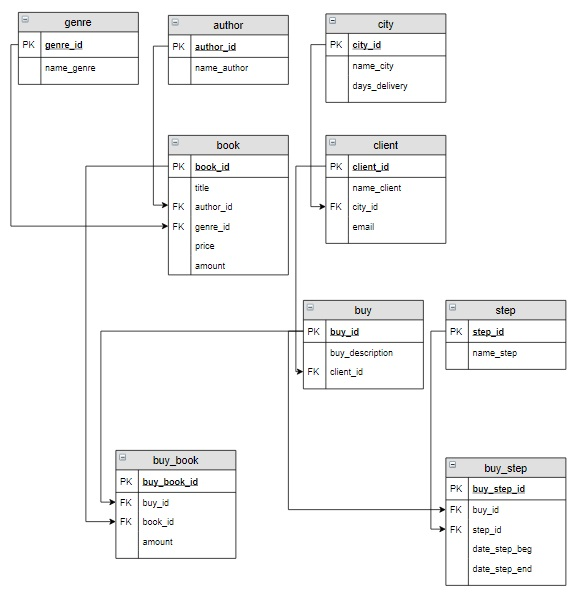

https://luciopaiva.com/markdown-toc/

## Table of contents:

- [Core](#core)
- [class_Server](#class_server)
- [Postgres DB](#postgres-db)
- [Migrations](#migrations)
- [Auth](#auth)
- [Response_logging](#response_logging)
- [class_BaseValidator](#class_basevalidator)
- [Reports](#reports)

## Tech Stack

- Python, Poetry, Postgres, FastApi, Alembic, SQLAlchemy, Pydantic, FastApiUsers

## Run file
```api/__init__.py```

## Structure
Структура проекта представляет собой набор пакетов.
Ключевые файлы вынесены в папку ```api/core```
```
api/core
├── localizators
├── logging
├── resources
├── routes
├── validators
└── server.py
```

## Naming

## class Server
Для удобной работы с приложением FastAPI, а также
для создания единой точки регистрации роутеров,
используется класс Server.
```
api/core/server.py

class Server:

    __app: FastAPI

    def __init__(self, app: FastAPI):
        self.__app = app
        self.__register_routes(app)
```

## Postgres DB Migrations

Для миграций используется Alembic.

Каждая таблица создается и инициализируется отдельно,
что позволяет при необходимости удобно вносить необходимые изменения.


Схема базы данных



## Auth
Аутентификация пользователей
реализована при помощи FastApiUsers.
- Database adapter: SQLAlchemy
- Transport: Cookie
- Strategy: JWT


## Server response logging

## Custom Validator Documentation
class BaseValidator - это универсальный класс, который позволяет создавать карты валидации
(наборы правил проверки) для различных экземпляров pydantic-моделей, а также осуществлять
валидацию в соответствии с этими картами валидации.
```
BaseValidator.py

class BaseValidator:
    def __init__(self, item, session):
        self.item = item            - объект pydantic-модели
        self.rules = []             - список правил проверки для полей объекта item
        self.errors = {}            - список ошибок, выявленных в процессе валидации
        self.is_valid = True        - флаг, отражающий общий результат проверки
        self.session = session      - текущая сессия (необходима для запуска 
                                                      условных и проверочных функций)

Структура self.rules:
[
    {
        "property_name": property_name_1,
        "property_value": property_name_func(self.item),
        "property_name_func": property_name_func,
        "checklist":
         [
            {
            "check_function": check_function_1,
            "message": "Data validation failed",
            "when_function": None,
            "msg_params": {}
            }
            {
            "check_function": check_function_2,
            "message": "Data validation failed",
            "when_function": None,
            "msg_params": {}
            }
            ...            
        ]
    },
    {
        "property_name": property_name_2
        ...
    }
    ...
]

    def rule_for            - добавляет в self.rules валидационное правило для поля объекта self.item
    
    def must                - добавляет в self.rules проверочную функцию ("check_function")
                              для валидационного правила
                              Для каждого правила можно добавлять любое к-во проверочных функций.
                              В качестве проверочных функций могут выступать как специфические
                              пользовательские функции, так и типовые методы класса BaseValidator:
                              is_empty, is_not_empty...is_in_enum, matches (см.ниже)
                              
    def message             - добавляет в self.rules
                              для конкретной проверочной функции ("check_function")
                              сообщение ("message") об ошибке валидации (опционально)
                              Если данную функцию не использовать, то в случае возникновения
                              ошибки валидации будет выведено сообщение по умолчанию
                              
    def when                - добавляет в self.rules
                              для конкретной проверочной функции ("check_function")
                              условную функцию ("when_function") (опционально)
                              Если результат выполнения условной функции True - проверочная 
                              функция будет выполнена, в противном случае проверочная функция
                              будет игнорироваться
                              
    def response_content    - формирует структуру ошибки валидации для её последующего
                              добавления в self.errors
                              {
                                  "title": "Data validation error",
                                  "status": 422,
                                  "errors": self.errors
                              }
    
    async def validate      - асинхронный метод, запускающий процесс валидации
                              в соответствии со сформированной картой валидации
    
    Типовые проверочные методы (для передачи в def must):
    
    def is_empty
    def is_not_empty
    def is_null
    def is_not_null
    def equal
    def not_equal
    def greater_than
    def greater_than_or_equal
    def less_than
    def less_than_or_equal
    def maximum_length
    def minimum_length
    def exclusive_between
    def inclusive_between
    def length
    def precision_scale
    def is_in_enum
    def matches

```
class AuthorValidator(BaseValidator) - это класс, создающий карту валидации
(набор правил проверки) для конкретной pydantic-модели (Author)
```
AuthorValidator.py

class AuthorValidator(BaseValidator):
    def __init__(self, item: AuthorValidateSchema, session, lang: str):
        super().__init__(item, session)
        self.rule_for("name_author", lambda x: x.name_author) \
            .must(is_unique_name_author) \
            .message(_(lang, "ERR_UniqueValue"))
```

Обратите внимание, что методы rule_for, must, message, when возвращают self,
благодаря чему мы можем записывать их друг за другом через точку,
формируя таким образом нашу карту валидации.

```
Примеры использования:

self.rule_for().must()
self.rule_for().must().message()
self.rule_for().must().message().when()
self.rule_for().must().message().must().message()
self.rule_for().must().message().when().must().message().when()
```

На первом месте всегда стоит rule_for. Он определяет поле объекта, которое мы будем валидировать.
На втором месте всегда стоит must. Он задает проверочную функцию для поля нашего объекта.
Метод message добавляется опционально (рекомендуется)
если мы хотим кастомизировать текст сообщения об ошибке.
Метод when добавляется опционально если мы хотим добавить условие запуска проверочной функции.

Важно!
Количество функций must может быть любым. Таким образом, мы можем задавать любое число проверок
для поля нашего объекта.

```
Пример:

self.rule_for().must().must().must()
```
В этом случае, при запуске валидации, мы для поля ХХ выполним 3 различные проверки.
При этом будут использоваться сообщения об ошибках по умолчанию.

Рекомендуется после каждой функции must вызывать функцию message.
Это позволит получать точную информацию о возникшей ошибке валидации.
```
Пример:

self.rule_for().must().message().must().message().must().message()
```

Для того, чтобы в роутере осуществить валидационную проверку нашего объекта
достаточно создать экземпляр класса AuthorValidator и вызвать
асинхронный метод validate()
```
AuthorRouter.py

            validator = AuthorValidator(author, session, lang)
            await validator.validate()
```


## Reports

## References
- https://www.python.org/doc/
- https://python-poetry.org/docs/
- https://fastapi.tiangolo.com
- https://fastapi.qubitpi.org/tutorial/
- https://docs.sqlalchemy.org/en/20/
- https://alembic.sqlalchemy.org/en/latest/index.html
- https://docs.pydantic.dev/latest/
- https://fastapi-users.github.io/fastapi-users/latest/

