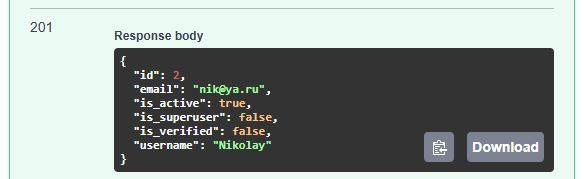

# BookShopAPI v.1.0 «Магазин книг»

## Общая информация
API-интерфейс интернет-магазина книг, реализованный в соответствии с принципами ```REST```.

Приложение разработано на ```FastAPI``` с использованием базы данных ```Postgres``` и
```ORM SQLAlchemy``` в асинхронной реализации. 
Простая удобная структура проекта позволит легко масштабировать его, в случае необходимости.
Аутентификация реализована на базе библиотеки ```FastAPIUsers```, с использованием
```Cookie``` и ```JWT-токена```.

Для создания структуры таблиц и загрузки данных использвется библиотека ```alembic```.

В проекте разработан универсальный механизм проверки данных, который позволяет
создавать ```карту валидации``` любой сложности для заданной ```Pydantic-схемы``` и выполнять проверку.
Все сообщения сервера, включая валидационные, выдаются
с учетом языка локализации (```ru, en```).

Тестирование роутеров реализовано с использованием библиотеки ```pytest```.
Каждый роутер проверяется набором асинхронных тестовых функций.

## Оглавление:


- [Технологический стек](#технологический-стек)
- [Запуск приложения](#запуск-приложения)
- [Структура проекта](#структура-проекта)
- [Создание базы данных и проведение миграций](#создание-базы-данных-и-проведение-миграций)
  - [Создание базы данных](#создание-базы-данных)
  - [Проведение миграций](#проведение-миграций)
- [Схема базы данных](#схема-базы-данных)
- [Авторизация](#авторизация)
  - [Роутеры авторизации](#роутеры-авторизации)
- [Логирование](#логирование)
- [Внедрение зависимостей](#внедрение-зависимостей)
- [Локализация](#локализация)
  - [Локализация серверных сообщений](#локализация-серверных-сообщений)
  - [Локализация валидационных сообщений](#локализация-валидационных-сообщений)
- [Валидация](#валидация)
  - [Карта валидации](#карта-валидации)
  - [Структура карты валидации](#структура-карты-валидации)
  - [Пример создания карты валидации](#пример-создания-карты-валидации)
    - [Инициализационная функция](#инициализационная-функция)
    - [Проверочная функция](#проверочная-функция)
    - [Условная функция](#условная-функция)
    - [Информационная функция](#информационная-функция)
  - [Запуск проверки](#запуск-проверки)
- [Тестирование](#тестирование)
  - [Описание фикстур](#описание-фикстур)
- [Получение сводных данных для отчётов](#получение-сводных-данных-для-отчётов)
  - [Пример запроса с INNER JOIN, FILTER, [NOT] EXISTS, ORDER BY](#пример-запроса-с-INNER-JOIN-FILTER-NOT-EXISTS-ORDER-BY)
  - [Пример запроса с LEFT JOIN, SUBQUERY, SUM(), GROUP BY, COALESCE()](#пример-запроса-с-LEFT-JOIN-SUBQUERY-SUM-GROUP-BY-COALESCE)
- [Полезные ссылки](#полезные-ссылки)


## Технологический стек

- ```Python```, ```Poetry```, ```Postgres```, ```FastAPI```, ```Alembic```, ```SQLAlchemy```, ```Pydantic```, ```FastAPIUsers```

В качестве базы данных ```Postgres``` можно использовать как ```PostgreSQL```, так и ```Postrges Pro```.

## Запуск приложения
Установка ```Python``` и ```Poetry```:
1. Установите ```Python 3.11```
2. Установите ```Poetry``` для работы с виртуальным окружением

Создание и подготовка базы данных: ([см. подробнее...](#создание-базы-данных-и-проведение-миграций))
1. Создайте базу данных
2. Настройте файл ```.env```
3. Проведите миграции

Запуск приложения:
1. Создайте каталог для проекта
2. Загрузите проект на свой компьютер
3. Создайте и активируйте виртуальное окружение
4. Установите необходимые библиотеки командой ```poetry install```
5. Запустите файл ```api/__init__.py```


## Структура проекта

Структура проекта представляет собой набор пакетов,
ключевые файлы которого вынесены в папку ```./api/core```:
```
api/core
├── localizators
├── logging
├── resources
├── routes
├── validators
└── server.py
```

Для удобной работы с приложением ```FastAPI```, а также
для создания единой точки регистрации роутеров,
используется класс ```Server```.
```
./api/core/server.py

class Server:

    __app: FastAPI

    def __init__(self, app: FastAPI):
        self.__app = app
        self.__register_routes(app)
```

## Создание базы данных и проведение миграций

### Создание базы данных
1. Установите ```СУБД Postrgres``` (```Postrges Pro```)

[Загрузить Postrges Pro](https://postgrespro.ru/products/download)

2. Установите ```pgAdmin``` — платформу для администрирования и настройки ```СУБД Postgres```

[Загрузить pgAdmin](https://www.pgadmin.org/download/)

3. Подготовка ```pgAdmin``` к работе
- Создайте сервер, например ```Postgres Pro 14 (64bit)```


- Задайте имя пользователя, например ```postgres```
- Задайте пароль, например ```postgres```
- Подключитесь к серверу


- Создайте базу данных, например ```bookshop_db2```


### Проведение миграций

```./migrations```

1. Общая информация

Миграционные файлы с необходимыми для библиотеки ```alembic```
инструкциями по добавлению схем, а также
созданию и заполнению таблиц, находятся в папке:
```./migrations/versions```


Каждая таблица создается и инициализируется отдельным
миграционным файлом, что позволяет
при необходимости удобно вносить изменения.


К важным миграционным файлам также относятся:
- ```.env``` (файл, из которого берётся информация
о базе данных, как для проведения миграций,
так и для подключения к ней при запуске приложения)
- ```alembic.ini```


2. Перед запуском миграций, необходимо:
- Убедиться, что создана пустая база данных
- Убедиться, что создано и инициализировано виртуальное
окружение проекта (в том числе установлена библиотека
```alembic```)
- Убедиться, что в файле ```.env``` указана верная информация
о созданной базе данных

3. Запуск миграций

Для запуска необходимо в терминале перейти в папку проекта
и выполнить команду ```alembic upgrade head```


После успешного завершения процесса необходимо открыть
```pgAdmin``` и убедиться, что в базу данных успешно добавлены
схемы ```books``` и ```users```, а также таблицы
и данные, согласно миграционным файлам.


Чтобы увидеть созданные таблицы, перейдите в схему,
например ```books```, и выберите ```Tables```.

Чтобы увидеть данные таблиц, щелкните правой кнопкой мыши
по названию базы данных ```bookshop_db2``` и выберите пункт
```Query Tool```. В открывшемся окне ```Query``` напишите
любой запрос на выборку данных, например ```select * from books.book```
и нажмите кнопку ```Execute script (F5)```.


После завершения инициализации базы данных
приложение готово к работе.


## Схема базы данных


## Авторизация
```./auth```

Авторизация пользователей в нашем проекте реализована при помощи ```FastAPIUsers```.

Библиотека ```FastAPIUsers``` совместима с различными ```ORM``` и базами данных.
В нашем проекте в качестве адаптера базы данных используется
```ORM SQLAlchemy```. В качестве средства подтверждения
прав пользователя
используется ```JWT-токен```, который передается в роутер
с помощью ```Cookie```.


### Роутеры авторизации


Для регистрации нового пользователя используйте ```/register``` роутер.
Заполните тело запроса например так:


В случае успешной регистрации вернется ```201``` код ответа
и тело ответа с данными зарегистрированного пользователя.
При этом пароль пользователя будет скрыт.



Для входа в систему используйте ```/login``` роутер.
```FastAPIUsers``` предоставляет специальную форму запроса,
состоящую из набора полей, доступных для заполнения.

Для входа достаточно заполнить два обязательных поля:

1. ```username``` (здесь необходимо указать почту
зарегистрированного пользователя)
2. ```password``` (здесь необходимо указать пароль
зарегистрированного пользователя)


В случае успешного входа в систему
вернется ```204``` код ответа.

Для выхода из системы используйте ```/logout``` роутер.

## Логирование
```./api/core/logging```

Важно! Для корректной работы логирования необходимо добавить в корень проекта папку ```.log```

Настройка параметров логирования осуществляется в специальном конфигурационном файле:
```
./api/core/logging/log_config.py

'formatters'    - форматы логирования
'handlers'      - настройки обработчиков потоков логирования
'loggers'       - настройки отслеживаемых логгеров
```

Логгеры записывают результат своей работы как в консоль,
так и в специальные текстовые файлы ```application.log``` в папке ```.logs```.
Ограничений по записи в файлы нет. После того, как 5 лог-файлов
будут полностью заполнены, приложение начнет их перезапись,
начиная с первого.

Пример логирования роутера ```GET /genres/ Get item```:

В начале происходит запрос к таблице ```users.user```, чтобы получить 
информацию о пользователе. После того, как мы 
идентифицировали пользователя и убедились, что он
имеет доступ к данному роутеру, выполняется ```Get-запрос```
на получение данных из таблицы ```books.genre```


## Внедрение зависимостей
```./api/dependencies.py```

Внедрение зависимостей (```Dependency Injection```) - мощный
инструмент ```FastAPI```, позволяющий, используя аннотации, выполнять
настройку как всего приложения, так и отдельных
роутеров.

Например, благодаря внедрению в ```FastAPI-приложение```
функции ```get_current_language```
мы добавили ```header-параметр "accept-language"```,
необходимый для локализации, сразу во все ```конечные точки```
нашего приложения:

```
./api/__init__.py

app = FastAPI(dependencies=[Depends(get_current_language)])
```

Функция ```get_current_language``` возвращает язык локали,
установленный в браузере, либо язык по умолчанию (```en```),
в случае если наше приложение не поддерживает язык локали
данного пользователя.

Поле ```accept-language```, которое отображается в ```Swagger```
благодаря внедрению зависимостей, можно заполнить и вручную,
принудительно указав тот язык локали, на котором мы
хотим получить сообщение от сервера.


Здесь показан пример того, как благодаря внедрению в роутер
функции ```get_user_settings```, во все ```конечные точки``` роутера
передаются настройки пользователя:

1) Язык локализации серверных сообщений (```ru, en```)

```lang = current_user_settings['current_language']```

2) Данные пользователя

```user = current_user_settings['user']```


```
./api/routers/AuthorRouter.py

router = APIRouter(
    prefix="/authors",
    tags=["Authors"],
    dependencies=[Depends(get_user_settings)]
)

...

@router.get("/{row_id}")
async def get_item_by_id(row_id: int, current_user_settings = Depends(get_user_settings)) -> AuthorGetItemSchema:
    lang = current_user_settings['current_language']
    user = current_user_settings['user']
    item = await AuthorRepository.get_by_id(row_id, lang, user)
    return item
```
Аутентификация осуществляется непосредственно
внутри функции ```get_user_settings```.


## Локализация
```./api/core/localizators```

Локализационные сообщения хранятся
в папке ```./api/core/resources/localize``` 
в виде набора ```JSON``` файлов.


```
messages.en.json
{
  "400BadRequest": "Bad request",
  "404NotFound": "Data not found",
  "ERR_UniqueValue": "The value must be unique"
}
```
```
 messages.ru.json
{
  "400BadRequest": "Некорректный запрос",
  "404NotFound": "Данные не найдены",
  "ERR_UniqueValue": "Значение должно быть уникальным"
}
```
Данный подход позволяет, в случае необходимости,
легко добавить новый локализационный язык.
Для этого нужно:
1. Добавить новый ```JSON``` файл с
соответствующими локализационными данными в папку ```resources/localize```
2. В файле ```localizator.py``` добавить в массив
```supported_langs``` новый язык и задать язык
по умолчанию в переменной ```default_language```


Функция ```load_localize_data``` осуществляет считывание
данных из всех доступных локализационных ```JSON``` файлов
и формирует на их основе локализационный словарь.

```
./api/__init__.py

def application() -> FastAPI:

    app = FastAPI()

    logger.info("Localization data loading...")
    load_localize_data()
    logger.info("Localization data successfully loaded.")
```


### Локализация серверных сообщений
```
./api/core/localizators/validation_problem.py
```
Описание функции ```validation_problem```:

```
def validation_problem(lang: str, status: int, content: dict | None = None) -> JSONResponse:
    """
    Функция формирует ответ сервера, с учетом языка локали.
    
    :param lang: язык локали
    :param status: статус ошибки
    :param content: информация об ошибках, представленная в виде словаря (опционально)
    :return: экземпляр класса fastapi.responses.JSONResponse
    """

```

Применение функции ```validation_problem```:

```
./api/routers/AuthorRouter.py

    # 1) Запись не найдена в базе данных
    if not row:
        return validation_problem(lang=lang, status=HTTPStatus.NOT_FOUND)


    # 2) Запись была отредактирована другим пользователем
    if row.row_version != data.row_version:
        return validation_problem(lang=lang, status=HTTPStatus.PRECONDITION_FAILED)

                
    # 3) Запись не прошла валидацию
    if not validator.is_valid:
        return validation_problem(lang=lang, status=HTTPStatus.UNPROCESSABLE_ENTITY,
                                  content=validator.response_content())                

    # 4) Произошла ошибка при работе с базой данных
    except SQLAlchemyError as e:
        return validation_problem(lang=lang, status=HTTPStatus.CONFLICT)

```

### Локализация валидационных сообщений
```
./api/core/localizators/localizator.py
```
Описание функции ```get_localize_text```:

```
def get_localize_text(lang: str, msg_key: str) -> str:
    """
    Функция возвращает локализационное сообщение
    из локализационного словаря translations, соответствующее
    передаваемому языку и ключу сообщения
    
    :param lang: язык локали
    :param msg_key: ключ сообщения
    :return: локализационное сообщение
    
    Рекомендуется применять alias при импорте функции:
    import get_localize_text as _
    """
    msg_str = translations.get((lang, msg_key), "")
    return msg_str

```

Применение функции ```get_localize_text```:

```
./api/core/validators/BookValidator.py

from api.core.localizators import get_localize_text as _

  def __init__(self, item: BookValidateSchema, session, lang: str):
      super().__init__(item, session)
      self.rule_for("title", lambda x: x.title) \
          .must(is_unique_book_title) \
          .message(_(lang, "ERR_UniqueValue"))
                   ^
             get_localize_text
```


## Валидация
```./api/validators```

Основным средством, помимо стандартной валидации от ```pydantic```,
позволяющим осуществлять валидацию данных
в проекте, является ```class BaseValidator```.
Благодаря этому универсальному классу, мы можем
создавать необходимые нам карты валидации
(наборы правил проверки) для различных экземпляров
```pydantic-схем```, а также можем запускать проверки
в соответствии с этими картами.


### Карта валидации

В той ```pydantic-схеме```, которую мы собираемся валидировать,
как правило, есть множество полей. Общую проверку осуществляет
```pydantic``` при помощи функции ```model_validate```

```
AuthorRouter.py

class AuthorRepository:

    @classmethod
    async def add_one(cls, data: AuthorAddSchema, lang: str, user: User) -> AuthorGetItemSchema | JSONResponse:
        async with db_session() as session:
            author = AuthorValidateSchema.model_validate(data)
                                                ^
                                   стандартная валидация от pydantic

```


В случае, когда помимо общей проверки, необходимо
осуществить дополнительную проверку конкретных полей
на соответствие тем или иным условиям, мы используем
так называемые ```карты валидации```.

Карта валидации - набор правил проверки для ```pydantic-схемы```.

### Структура карты валидации

1. [```rule_for```] - инициализационная функция (для поля 1)
   - [```must```],[```is_empty```],[```less_then```]...[```matches```] - проверочная функция
   - [```when```] - условная функция (опционально)
   - [```message```] - информационная функция (опционально)
   - ...
   - [```must```],[```is_empty```],[```less_then```]...[```matches```] - проверочная функция
   - [```when```] - условная функция (опционально)
   - [```message```] - информационная функция (опционально)
2. [```rule_for```] - инициализационная функция (для поля 2)
   - [```must```],[```is_empty```],[```less_then```]...[```matches```] - проверочная функция
   - [```when```] - условная функция (опционально)
   - [```message```] - информационная функция (опционально)
3. [```rule_for```] - инициализационная функция (для поля 3)
   - и так далее...

```Карта валидации``` должна состоять как минимум из
одного правила, которое определяется инициализационной
функцией ```[rule_for]```. Ограничений по количеству правил внутри карты 
валидации нет. Для одного поля может быть задано одно или несколько 
правил. Внутри одного правила количество проверочных, условных и
информационных функций может быть произвольным.


### Пример создания карты валидации

Рассмотрим создание карты валидации ```AuthorValidator```
для ```pydantic-схемы AuthorValidateSchema``` и процесс
запуска проверки внутри роутера.
```
AuthorValidator.py

from api.core.validators import BaseValidator
from api.core.validators.validate_funcs import is_unique_name_author
from api.core.localizators import get_localize_text as _
from api.schemas import AuthorValidateSchema

class AuthorValidator(BaseValidator):
    def __init__(self, item: AuthorValidateSchema, session, lang: str):
        super().__init__(item, session)
        self.rule_for("name_author", lambda x: x.name_author) \
            .must(is_unique_name_author) \
            .message(_(lang, "ERR_UniqueValue"))
```
```
AuthorRouter.py

class AuthorRepository:

    @classmethod
    async def add_one(cls, data: AuthorAddSchema, lang: str, user: User) -> AuthorGetItemSchema | JSONResponse:
        async with db_session() as session:
            author = AuthorValidateSchema.model_validate(data)
            validator = AuthorValidator(author, session, lang)
            await validator.validate()
            ...
```
Как мы видим, карта валидации представляет собой класс
```AuthorValidator```,
который наследуется от класса ```BaseValidator```, и 
единственным элементом которого является конструктор.

В конструктор должны передаваться следующие аргументы:
- ```item``` - экземпляр ```pydantic-схемы```
- ```session``` - асинхронная сессия
- ```lang``` - язык локали

Первой строкой в конструкторе ```AuthorValidator``` мы запускаем конструктор 
базового класса ```super().__init__(item, session)```,
после чего начинаем непосредственно формировать
саму карту валидации.

```
ВАЖНО!
Обратите внимание, что методы
rule_for, must, when, message и другие встроенные методы
возвращают self, т.е. ссылку на экземпляр класса!

Благодаря этому мы можем записывать их
друг за другом через точку, формируя
таким образом карту валидации!
```

#### Инициализационная функция

Каждая инициализационная функция работает в
связке с проверочными, условными и информационными функциями.

Мы называем```rule_for``` инициализационной функцией,
т.к. под капотом класса ```BaseValidator``` она
создаёт и инициализирует словарь, без которого
не могут работать другие функции: ни проверочные,
ни условные, ни информационные.

Поэтому, при создании карты валидации, функция ```rule_for```
всегда стоит на первом месте.

Пример:

```
./api/core/validators/AuthorValidator.py

class AuthorValidator(BaseValidator):
    def __init__(self, item: AuthorValidateSchema, session, lang: str):
        super().__init__(item, session)
        self.rule_for("name_author", lambda x: x.name_author) \
                ^
```

Функция ```rule_for``` принимает параметры:
- ```property_name: str``` = ```"name_author"```
- ```property_name_func: Callable``` = ```lambda x: x.name_author```

В нашем примере функция ```rule_for``` добавляет
новое валидационное правило
для поля ```name_author``` объекта ```x```.
В качестве объекта ```x``` будет выступать тот экземпляр
```pydantic-схемы```, который в дальнейшем будет передан в конструктор.
В данном случае, этим ```x``` будет ```author```:
```
AuthorRouter.py

class AuthorRepository:

    @classmethod
    async def add_one(cls, data: AuthorAddSchema, lang: str, user: User) -> AuthorGetItemSchema | JSONResponse:
        async with db_session() as session:
            author = AuthorValidateSchema.model_validate(data)
            validator = AuthorValidator(author, session, lang)
                                           ^
                                           x
```

Параметру ```property_name``` рекомендуется передавать
атрибут, соответствующий названию проверяемого поля.
В данном случае это ```"name_author"```.

```
ВАЖНО!
Под капотом класса BaseValidator существует переменная property_value,
которая получает своё значение при выполнении лямбда-функции из rule_for.
```

В нашем примере мы имеем строку:

```self.rule_for("name_author", lambda x: x.name_author)```

Когда лямбда функция ```lambda x: x.name_author``` получит ```author```
в качестве параметра ```x```, то она незамедлительно выполнится, и
её результат будет сохранён во внутренней переменной ```property_value```.
Полученное значение ```property_value``` и будет в дальнейшем валидироваться при помощи
тех проверочных функций, которые мы укажем после ```rule_for```.


#### Проверочная функция

После инициализационной функции ```rule_for``` через точку
указывается одна из проверочных функций (```must``` или другая).

Примеры:
```
./api/core/validators/BookValidator.py

self.rule_for("genre_id", lambda x: x.genre_id) \
    .must(check_genre_id)\
```
```
./api/core/validators/BookValidator.py

self.rule_for("price", lambda x: x.price) \
    .greater_than_or_equal(0)
```

В качестве проверочной функции может выступать:
1. Универсальный метод ```must```, в который
нужно будет передавать ссылку на стороннюю функцию```check_function```
в которой мы сами должны будем прописать логику проверки данных.
2. Либо один из реализованных в
классе ```BaseValidator``` готовых проверочных методов,
внутри которых уже реализована вся логика проверки
```is_empty```, ```greater_than_or_equal``` и другие:

```
# Список доступных для использования проверочных функций

    def must(check_function)

    def is_empty()
    def is_not_empty()
    def is_null()
    def is_not_null()
    def equal()
    def not_equal()
    def greater_than()
    def greater_than_or_equal()
    def less_than()
    def less_than_or_equal()
    def maximum_length()
    def minimum_length()
    def exclusive_between()
    def inclusive_between()
    def length()
    def precision_scale()
    def is_in_enum()
    def matches()
```

При использовании функции ```must``` в качестве проверочной функции,
ей необходимо передать ```ссылку на асинхронную функцию```, в которой
реализована логика проверки. Такая функция должна возвращать ```True```,
если данные корректны, и ```False```, если данные некорректны.
Пример такой функции приведён ниже.

Асинхронная функция ```is_unique_name_author``` делает запрос к базе данных,
чтобы убедиться, что передаваемое ей значение ```v (имя автора)```
ещё не существует. Такая проверка необходима, чтобы
исключить повторное добавление в базу данных одного и того же автора.


```
./api/core/validators/validate_funcs/check_functions.py

async def is_unique_name_author(item, v: Any, session) -> bool:
    query = select(Author).where(and_(Author.name_author == v, Author.id != item.id))
    query_res = await session.execute(query)
    rows = query_res.scalars().all()
    if rows:
        return False
    return True
```
Для проверок которые валидируют только значение поля, и
которые не требуют обращения к базе данных, подходят
готовые проверочные методы класса ```BaseValidator```, такие как: ```is_empty```, ```greater_than_or_equal```,
`precision_scale` и др.

```
ВАЖНО!
Если проверочная функция провалилась, то последующие проверочные функции
внутри одного правила rule_for выполняться не будут и программа
сразу перейдёт к следующему rule_for.
```

#### Условная функция

После проверочной функции через точку
указывается условная функция ```when```.

Пример:
```
self.rule_for("price", lambda x: x.price) \
    .greater_than_or_equal(0) \
    .when(title_starts_with_T_letter_func)
```

Использовать условную функцию при формировании
карты валидации не обязательно. ```Этот шаг является
опциональным``` и, вероятно, не так часто необходим.
Однако, в некоторых случаях, возможность наложить
условие на выполнение проверочной функции может
быть полезным.


Условная функция ```when``` позволяет добавить
условие, при котором ```Проверочная функция```
([см. выше](#проверочная-функция))
будет выполнена.
В функцию ```when``` должна передаваться ссылка
на некую ```when_function``` (В нашем примере это ```title_starts_with_T_letter_func```), возвращающую ```True или False```.
Если при запуске проверки ```when_function``` вернет ```False```, то
```Проверочная функция```, которая указана перед конструкцией ```.when(when_function)```
будет проигнорирована, и программа перейдет к следующей ```Проверочной функции```.


#### Информационная функция

После проверочной функции (либо после условной
функции, в случае её применения) через точку
указывается информационная функция ```message```.

```Этот шаг также является опциональным```. Однако, мы всё же рекомендуем
после каждой проверочной функции указывать и информационную, чтобы
сообщение об ошибке носило не общий характер, а в точности
указывало на то, почему валидация провалилась.

Пример:
```
./api/core/validators/BookValidator.py

from api.core.localizators import get_localize_text as _


def __init__(self, item: BookValidateSchema, session, lang: str):
    super().__init__(item, session)
    self.rule_for("title", lambda x: x.title) \
        .must(is_unique_book_title) \
        .message(_(lang, "ERR_UniqueValue"))
    self.rule_for("author_id", lambda x: x.author_id) \
        .must(check_author_id)\
        .message(_(lang, "ERR_ValueNotFoundInList"))
    self.rule_for("genre_id", lambda x: x.genre_id) \
        .must(check_genre_id)\
        .message(_(lang, "ERR_ValueNotFoundInList"))
    self.rule_for("price", lambda x: x.price) \
        .greater_than_or_equal(0)\
        .message(_(lang, "ERR_ValueGreaterThanOrEqual"))\
        .precision_scale(10, 2)\
        .message(_(lang, "ERR_PrecisionScale"))
                 ^
           get_localize_text
```

Информационная функция ```message``` позволяет добавить сообщение,
которое будет привязано к ```Проверочной функции```,
указанной перед функцией ```message```.
Данное сообщение сохраняется под капотом и добавляется
в ответ сервера в тех случаях, когда связанная с ней проверка
провалилась.

Использование данной функции очень удобно не только потому
что мы можем добавить собственное подробное
описание ошибки, но еще и 
потому, что внутри ```message``` можно использовать локализационную
функцию ```get_localize_text```, что позволит нам получать
валидационные сообщения от сервера на языке локали.


### Запуск проверки

После того, как создана ```карта валидации```, ей можно воспользоваться
в роутере. В нашем примере в качестве ```карты валидации```
выступает класс ```AuthorValidator```.

Создаём экземпляр ```validator``` класса ```AuthorValidator```
и вызываем асинхронный метод ```validate```:
```
AuthorRouter.py

    validator = AuthorValidator(author, session, lang)
    await validator.validate()
    
    if not validator.is_valid:
        return validation_problem(lang=lang, status=HTTPStatus.UNPROCESSABLE_ENTITY,
                                  content=validator.response_content())            
```
После того, как отработает метод ```validate```
в атрибуте ```is_valid``` сохранится статус проверки.
Его мы используем для написания условия выхода из
функции роутера.

Если ```is_valid``` будет равен ```False```,
то сервер вернёт ```422``` ошибку и подробное описание тех
валидационных ошибок, которые возникли при проверке. Причем,
ошибки будут выдаваться на языке локали (необходимый
для этого атрибут ```lang``` также
передаётся в функцию ```validation_problem```).


Для примера, откроем наше приложение в ```Swagger``` и выполним 
запрос: ```POST / authors/ Add item```, указав в 
теле запроса следующие данные:
```
{
  "name_author": "Достоевский Ф.М."
}
```
Поскольку автор с таким именем уже существует в базе данных,
в результате выполнения запроса сервер вернёт ошибку:


Мы видим сообщение об ошибке на русском языке, поскольку
русский язык локали был взят из браузера.
Используя ```header-параметр``` ```accept_language```, мы
можем, используя ```Swagger```, вручную
указать в качестве языка локали ```en```. Тогда те же сообщения
сервера будут выдаваться на английском языке:


## Тестирование
```./tests```

Тестирование роутеров осуществляется
при помощи библиотеки ```pytest```

### Описание фикстур

Фикстуры, запускаемые перед началом процесса
тестирования, описаны в файле ```tests/conftest.py```

```
@pytest.fixtures:

anyio_backend       - осуществляет настройку библиотеки pytest
app                 - возвращает ссылку на приложение
base_url            - возвращает базовый url на котором запускается приложение
client              - возвращает асинхронного тестового клиента
test_user_data      - регистрирует тестового клиента и возвращает его описание
global_headers      - возвращает заголовки для роутеров
login_completed     - осуществляет вход (login) для тестового клиента
cookie_value        - возвращает значение cookie, необходимое для запуска роутеров
```


## Получение сводных данных для отчётов
```./reports```

Примеры демонстрируют синтаксис различных видов запросов в ```ORM SQLAlchemy```.
```
ВАЖНО!
В случае, когда в запросе берутся на все поля таблицы, а 
задаётся конкретный набор полей для выборки, использовать
для обработки результатов запроса
встроенную в SQLAlchemy функцию scalars недопустимо!
```
### Пример запроса с INNER JOIN, FILTER, [NOT] EXISTS, ORDER BY
```
  query = select(Book.id,
                 Book.title,
                 Author.name_author.label('author_name'),
                 Genre.name_genre.label('genre_name'),
                 Book.price,
                 Book.qty) \
      .join(Author, Book.author_id == Author.id) \
      .join(Genre, Book.genre_id == Genre.id) \
      .filter(~exists().where(BuyBook.book_id == Book.id)) \
      .order_by(Book.title.asc())
      
  query_res = await session.execute(query)

  result = []
  for row in query_res:
      result.append(BooksThatWasNotSoldSchema.model_validate(row))
   
```

Ключевое слово ```exists``` в ```SQLAlchemy``` работает
строго в связке с ```where```, например так:
```~exists().where```

### Пример запроса с LEFT JOIN, SUBQUERY, SUM(), GROUP BY, COALESCE()

```
  buy_book = select(BuyBook.book_id,
                   func.sum(BuyBook.qty).label('qty')
                   ).group_by(BuyBook.book_id).subquery()
  
  query = select(Book.id,
                 Book.title,
                 Author.name_author.label('author_name'),
                 Genre.name_genre.label('genre_name'),
                 Book.price,
                 Book.qty,
                 coalesce(buy_book.c.qty,0).label('qty_sold'),
                 (Book.qty - coalesce(buy_book.c.qty,0)).label('qty_balance')) \
      .outerjoin(buy_book, Book.id == buy_book.c.book_id) \
      .join(Author, Book.author_id == Author.id) \
      .join(Genre, Book.genre_id == Genre.id) \
      .where((Book.qty - coalesce(buy_book.c.qty,0)) > 0) \
      .order_by(Book.title.asc())

  query_res = await session.execute(query)

  result = []
  for row in query_res:
      result.append(QtyBalanceSchema.model_validate(row))
    
```

Функция ```COALESCE``` в ```SQL``` возвращает первый попавшийся
аргумент, отличный от ```NULL```.
Если же все аргументы равны ```NULL```, результатом тоже будет ```NULL```.


## Полезные ссылки
- https://www.python.org/doc/
- https://python-poetry.org/docs/
- https://fastapi.tiangolo.com
- https://fastapi.qubitpi.org/tutorial/
- https://docs.sqlalchemy.org/en/20/
- https://postgrespro.ru/
- https://www.pgadmin.org
- https://alembic.sqlalchemy.org/en/latest/index.html
- https://docs.pydantic.dev/latest/
- https://fastapi-users.github.io/fastapi-users/latest/

